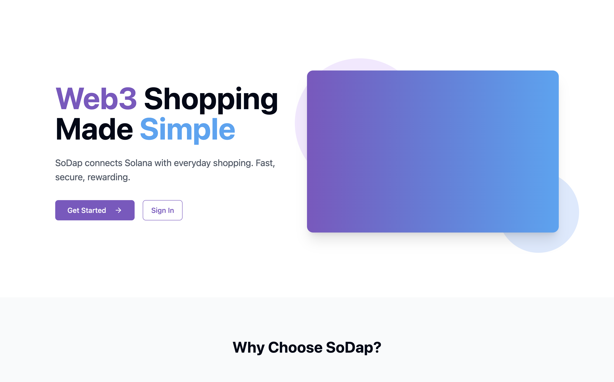
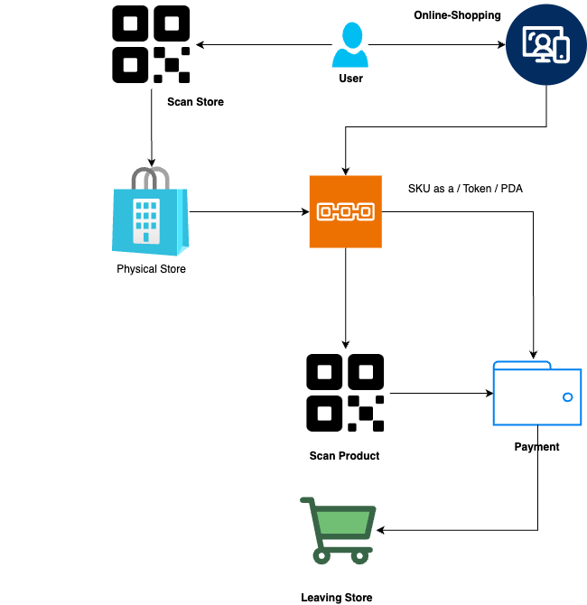

# Q2 2025 Builders Cohort Capstone(Sodap) Repository from tenrikut

[Sodap(Capstone)](https://github.com/tenrikut/sodap-mono.git): SoDap is a decentralized shopping platform powered by the Solana blockchain. It aims to revolutionize in-store shopping by providing secure, transparent, and efficient shopping experiences for both customers and store owners through blockchain-based payment processing and store management.

  
  <h3>Decentralized Shopping </h3>

  
  <h3>Decentralized Shopping </h3>

